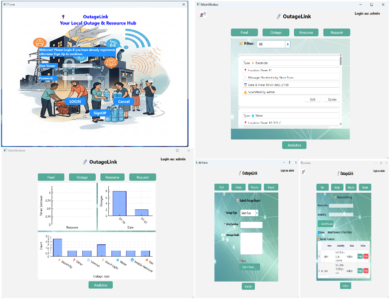

# 🔌 OutageLink App

**OutageLink** is a desktop-based C++/Qt application that enables users to report, track, and manage local outages like electricity, water, and internet disruptions. It also allows for neighborhood-level resource sharing (like borrowing a generator or Wi-Fi hotspot) during these outages.

---

## 🧩 Features

- 📝 **Report Outages**

  Users can submit new outage reports by selecting the type (e.g., electricity, water), entering the area and message. Each report includes an automatic timestamp.

- 👤 **User Accounts**

  Login and signup support with username/password authentication for access control.

- 🎯 **Identity-Based Tracking**

  Each report is tied to the user who submitted it. Only the original user can edit or delete their own reports, while admins can manage all reports.

- 📈 **Analytics Dashboard**

  Visual graphs and charts display outage trends over time, types of outages, and shared resource patterns using QCustomPlot.

- 📊 **Outage History & Trends**

  View and filter past outage reports, analyze frequency, and monitor repeated problem areas.

- 🧑‍💼 **Admin vs Guest Access**

  - `Username: admin / Password: 220055` logs in as administrator
  - Any other username becomes a guest (regular user) with limited access

- 🔐 **Secure File-Based Storage**

  All user data and reports are stored in structured JSON files, secured from unauthorized tampering.

- 🏡 **Resource Sharing Coordination**

  Users can request or offer helpful items (e.g., power banks, bottled water, UPS, extension cords) with timestamps and contact information.

- 💡 **Offline & Local Operation**

  The app works completely offline for local use. Future versions will support LAN-based syncing, lightweight encryption, and centralized data aggregation.

---

## 🛠️ Built With

- **C++**
- **Qt 6**
- **JSON for file storage**
- **MinGW on Windows**

---

## 🔒 Default Credentials

| Role  | Username | Password |
| ----- | -------- | -------- |
| Admin | admin    | password |
| Guest | *any*    | *unique* |

---

## 📁 Folder Structure

OutageLink-App/

├── src/ # Main application logic

├── ui/ # Qt UI files

├── assets/ # background images and icons

├── libs/ # Custom or third-party components (e.g., QCustomPlot)

└── README.md

---

## 📷 Screenshots Overview

---

## 🖥️ How to Install (No setup required)

Download the setup file from Google Drive:
👉 [Download Setup EXE](https://drive.google.com/file/d/1yQaj8BSuAh9i32oeWjblOTALmZe3qKwl/view?usp=drive_link)

⚠️ Windows SmartScreen Warning?
>*As installer is **not signed** so it will give that this is unsafe.

>Click "More info → Run anyway" — the installer is safe, but unsigned.

Launch the app and explore the available modes.

---

📄 License

This project is licensed under the MIT License — see LICENSE file for details.

---

🤝 Contributing

Pull requests are welcome. For major changes, please open an issue first to discuss your idea.

---

👨‍💻 Author

Muhammad Hasan Butt

🖥️ Software Engineering Undergraduate

📧 [hasan.butt2005@gmail.com]
